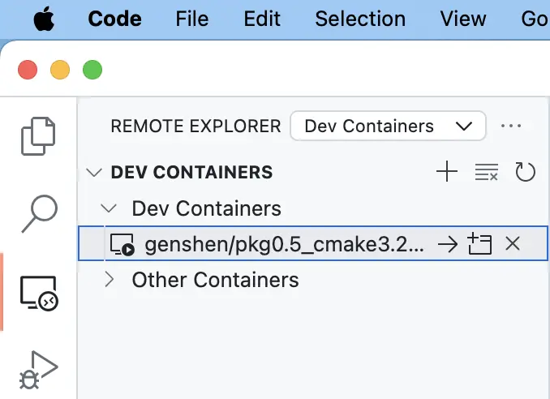

相信有很多有远程开发需求的同学，想用本地的IDE，但运行环境在远程。
例如，最近我需要在英伟达 GPU 上面写程序，需要 ssh 连接到实验室远程的一台机器上。
但这台机器为了满足不同用户的需求，没有在宿主主机上安装 CUDA 运行环境，大家都在这台机器上的 docker 的容器里面跑程序。

苦于在容器里面，没有直接的 IDE 来写代码，这篇文章主要介绍下如何配置我本地的 Mac 电脑，可以用我本地的 VS-Code 和 Jetbrains CLion 这两款编辑器/IDE连接到远程机器里面的容器，进行远程开发。

最终配置完成的效果就是：启动我 Mac 本地的IDE，就可在远程的容器里面进行开发、调试、运行：
```
| 我的本地系统上的 IDE | --ssh--> | 远程 Linux 机器(宿主) | --docker--> | docker 容器 |
```

## Step0: 前提条件
- 远程的Linux 宿主主机需要安装好 dockerd （docker 守护进程）。
- 远程 Linux 宿主主机支持 ssh 连接，并且有一个可用的用户。

<!--truncate-->

## Step1: 安装 docker client (Mac)
docker 分为守护进程和客户端。为了轻量级点，mac 就不安装守护进程了（例如，docker Desktop for Mac 包含守护进程和客户端），只安装客户端就行。 

可参照 docker 官网下文档进行安装（我安装的是 docker 26.1.4 版本）：
https://docs.docker.com/engine/install/binaries/#install-client-binaries-on-macos

这里，Mac 上的 docker client 的作用是，可以通过 ssh 连接，连接到远程 Linux 机器上，并识别上面的 docker 守护进程。
那么，我们就可以在 Mac 上通过诸如 `docker ps` 命令来操作远程 Linux 宿主主机上的容器了。

:::note
如果提示：“应用程序” 已损，可以参考 https://sysin.org/blog/macos-if-crashes-when-opening/ 解决。
:::

## Step2: VS-Code 远程开发配置

### 配置 docker context (Mac)
```bash
docker context create cuda-context --docker "host=ssh://user@remote_server_ip"
docker context use cuda-context
docker ps
```
注意：这里，ssh 可以配置好无密码的公钥、私钥认证。

然后，我们就可以基于某一个镜像，运行一个容器了，例如：
```bash
$ docker run --gpus all -d -v /home/genshen/data/workspace/:/workspace \
  -it genshen/pkg0.5_cmake3.22_clang18_hip6.2_cuda12.4_dev
6ae047056174ad629fa7f3382ba4364aea4c61c32546c92ca7a016eb6c608f02
```
这里，对于 volumn 的挂载部分，是将宿主 Linux 主机的路径挂在到容器中，而非 Mac 的路径挂在到容器中。
因此，我们需要将我们的代码上传到宿主 Linux 的 `/home/genshen/data/workspace/` 目录中才能进行开发。

### 配置 VS-Code
安装 Dev Containers 插件后，直接在“Remote Explorer”点击对应的容器，即可进行连接。这样就可以愉快地在 VS-Code 中进行开发了。



## Step3: CLion 远程开发配置
:::note
同样适用于 Jetbrains 家的其他 IDE。
:::

### 准备工作
先将代码上传到远程宿主主机 Linux 上面，代码里面需要包含一个特定的目录 `.devcontainer` 以及该目录下的 `devcontainer.json`文件。

这个文件可以参考：https://www.jetbrains.com/help/clion/connect-to-devcontainer.html#create_dev_container_inside_ide 。
该文件主要指定了使用哪种运行镜像以及如何构建镜像等要素。

### 配置工作
参考官网链接配置即可：
https://www.jetbrains.com/help/clion/connect-to-devcontainer.html#start_from_gateway。

主要步骤：
1. 在欢迎页面，点击 “Remote Development”，然后点击“Create Dev Containers”按钮。
2. 然后按钮“...”，添加一个Docker 连接配置。
   
3. 这里，选择 ssh 连接方式，配置远程 Linux 宿主主机的用户名和登录公钥，私钥。
4. 选择对应的IDE 和前面上传的项目的 `devcontainer.json` 文件（包含对应的镜像的 Dockerfile），即完成了远程开发的配置（需要远程Linux 宿主机安装Java 17+的环境）。
5. 后面点击构建好的容器，即可打开远程项目（`devcontainer.json` 文件所在的上级目录就是打开的项目）。

### 相关错误
1. 提示找不到 “docker”：
   ```log
   Worker binary deploy failed: Worker binary deploy failed: check command log for details: com.intellij.execution.process.ProcessNotCreatedException: Cannot run program "/usr/local/bin/docker": error=2, No such file or directory
   ```
   需要修改 CLion 配置 Build, Execution, Deployment › Docker › Tools 中的 docker 路径 和 docker-compose 路径为 Mac 系统安装的 docker和 docker-compose 的路径。
2. 错误：
    ```log
    Process exited with code 0
    Uploading Dev Containers command-line utility… done
    Removing previous dev container…
    Creating container…
    Container Id: 5293651bb4cfa8f0fcdf7af13817b5051f2feaeafaf0ee26b3e678b3a456aa66
    Container name: '/epic_diffie'
    Starting container '/epic_diffie'
    Preparing environment…
    Environment prepared
    Computing backend… done
    Status 500: Get \"https://registry-1.docker.io/v2/\":  read tcp 222.199.197.185:54562->34.226.69.105:443: read: connection reset by peer
    ```
  这是因为，2024年，docker hub 被强掉了，需要改下 docker register。
  可以从网上找可替代的镜像（如：https://github.com/dongyubin/DockerHub），修改 `/etc/docker/daemon.json` 文件，添加镜像。
